# Mô hình C4 - Module Thưởng Sự Kiện

## Level 1: Context Diagram

Sơ đồ ngữ cảnh hệ thống - mối quan hệ giữa hệ thống và các bên liên quan.

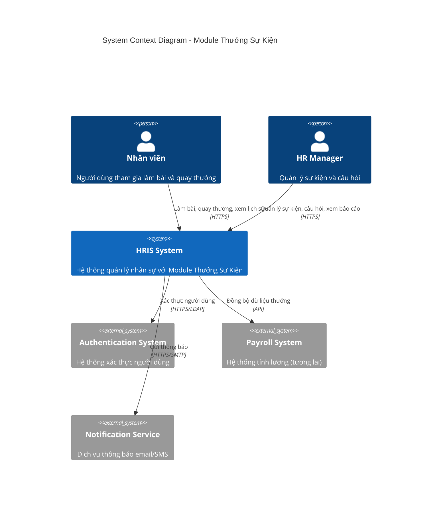

## Level 2: Container Diagram

Sơ đồ các containers (ứng dụng, cơ sở dữ liệu, services).

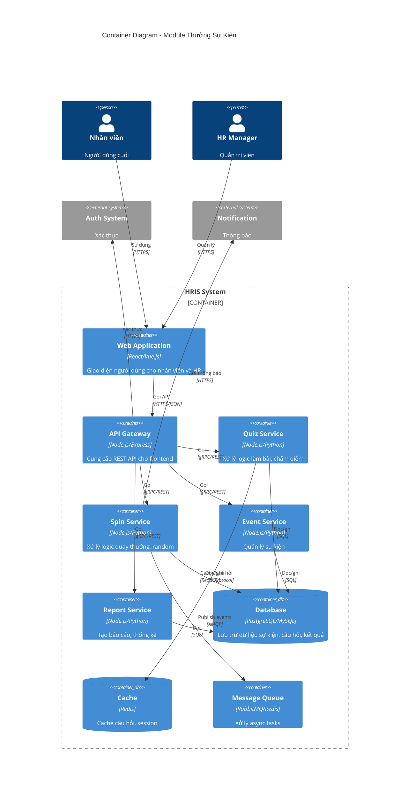

## Level 3: Component Diagram

Sơ đồ các components bên trong mỗi service.

### 3.1 Quiz Service Components

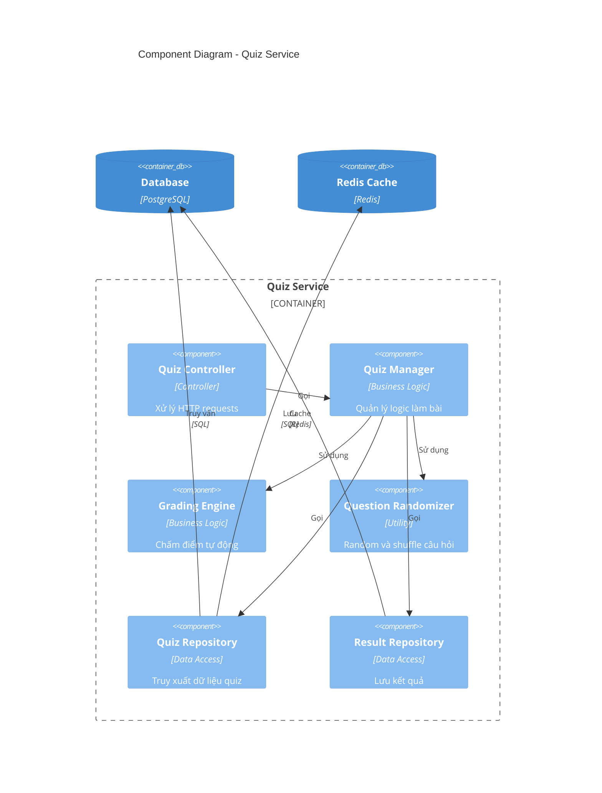

### 3.2 Spin Service Components

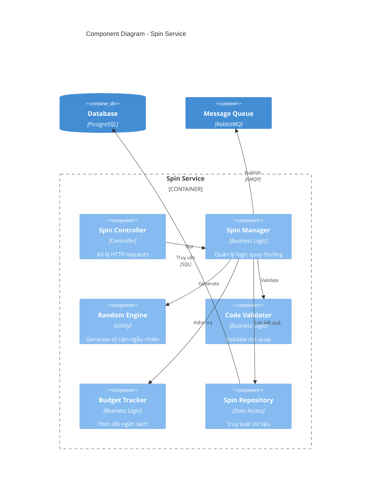

### 3.3 Event Service Components

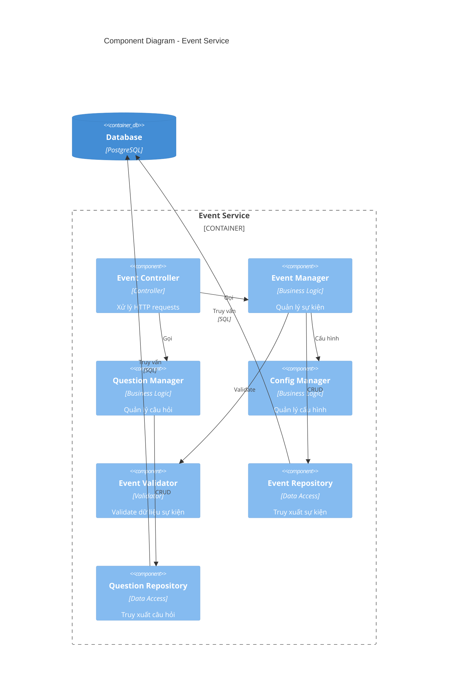

### 3.4 Report Service Components

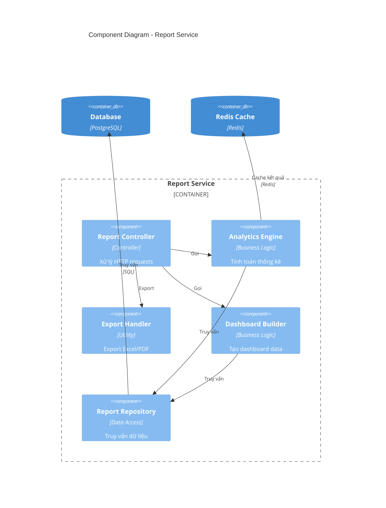

## Level 4: Code Diagram

Sơ đồ code cho một số classes quan trọng.

### 4.1 Quiz Manager - Class Diagram

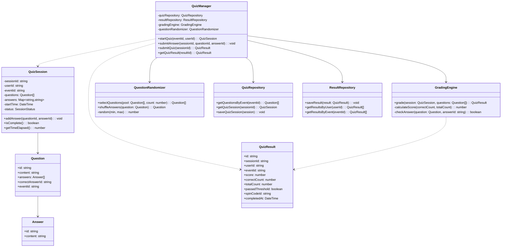

### 4.2 Spin Manager - Class Diagram

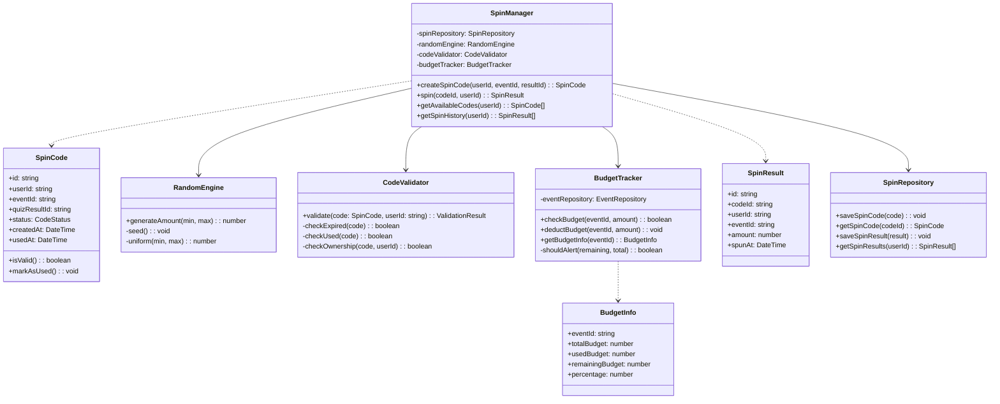

### 4.3 Event Manager - Class Diagram

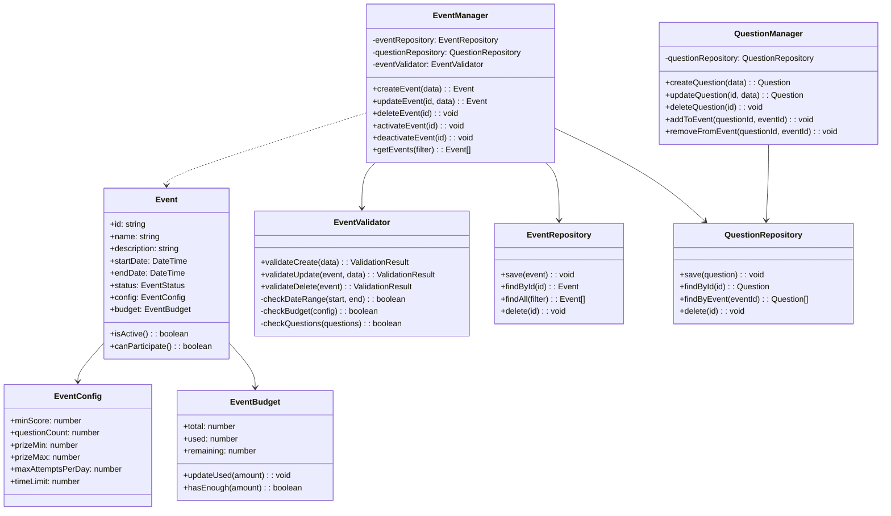

## Deployment Diagram

Sơ đồ triển khai hệ thống.

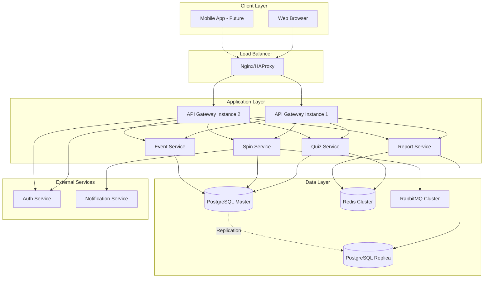

## Sequence Diagrams

### Luồng làm bài và nhận mã quay

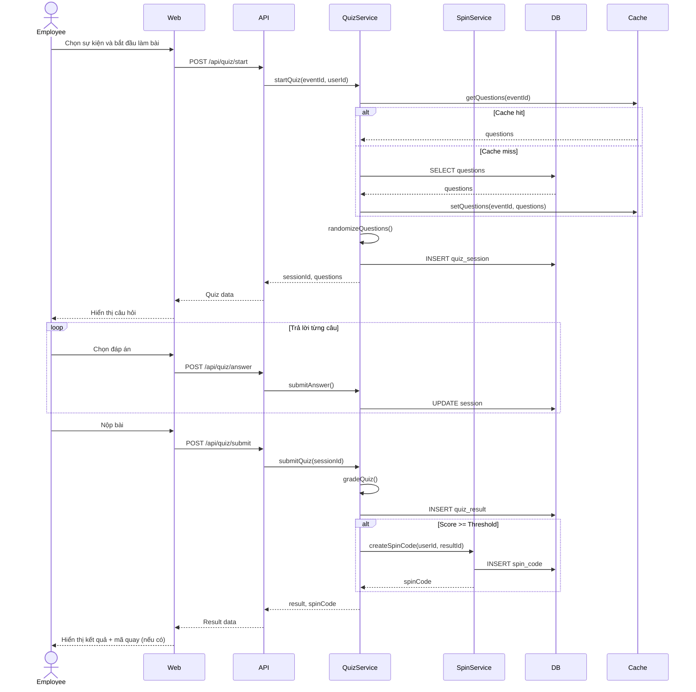

### Luồng quay thưởng

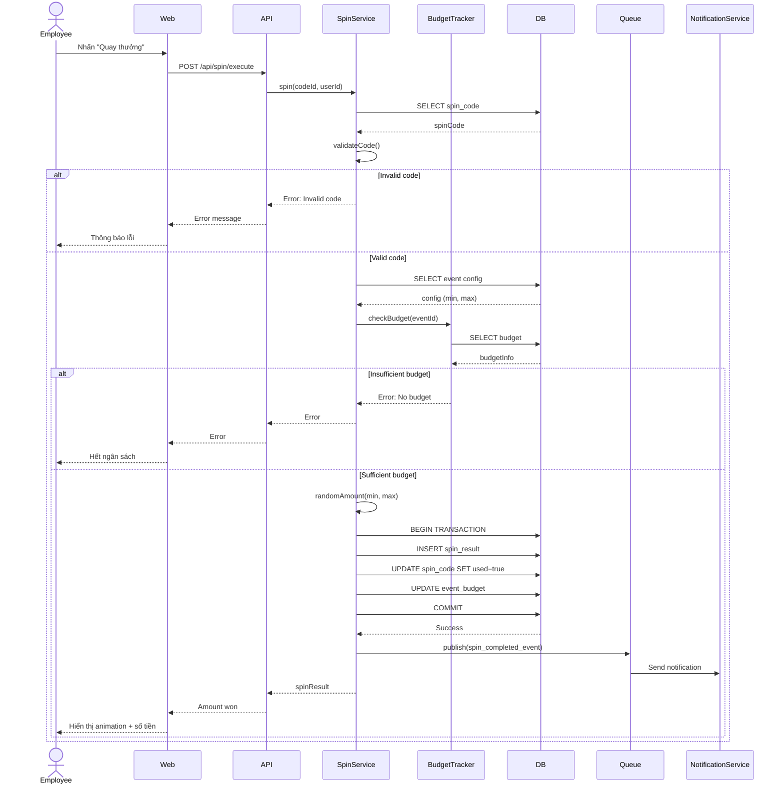

### Luồng tạo sự kiện (HR)

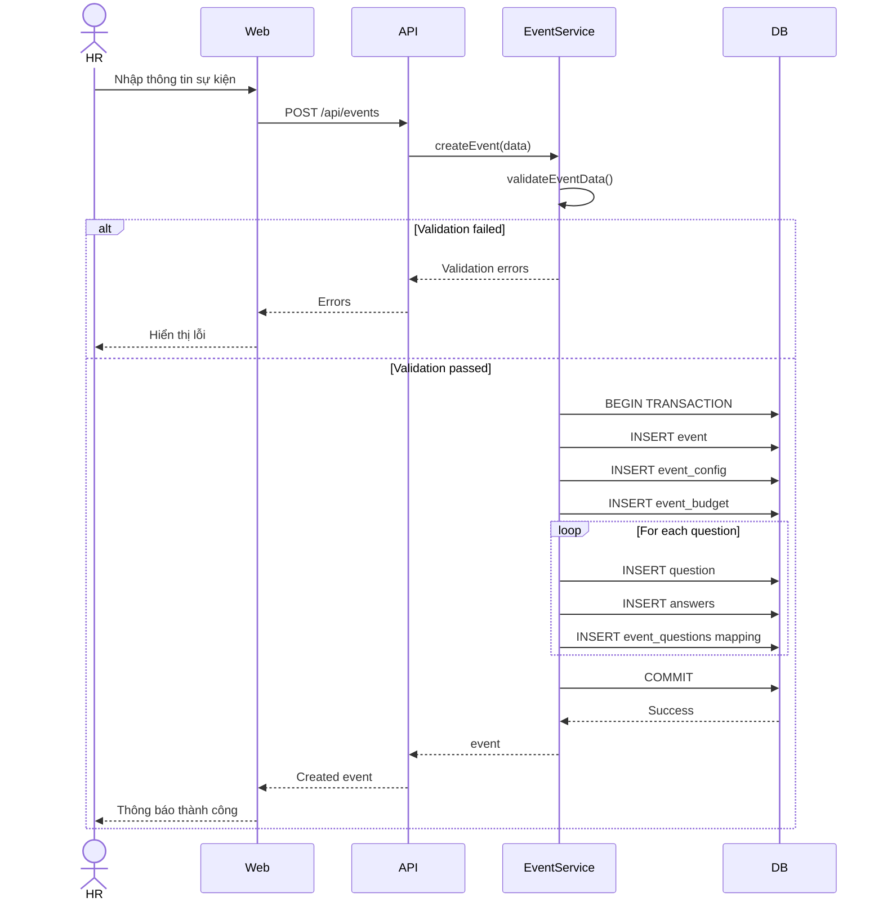

## Technology Stack Recommendation

### Frontend
- **Framework**: React với TypeScript
- **State Management**: Redux Toolkit / Zustand
- **UI Library**: Material-UI / Ant Design
- **Animation**: Framer Motion (cho vòng quay)
- **API Client**: Axios / React Query

### Backend
- **Runtime**: Node.js (Express) hoặc Python (FastAPI)
- **API Gateway**: Express Gateway / Kong
- **Microservices**: NestJS (Node) / FastAPI (Python)
- **ORM**: Prisma (Node) / SQLAlchemy (Python)
- **Validation**: Joi / Zod (Node) / Pydantic (Python)

### Database
- **Primary DB**: PostgreSQL 14+
- **Cache**: Redis 6+
- **Message Queue**: RabbitMQ / Redis Pub/Sub

### DevOps
- **Container**: Docker
- **Orchestration**: Docker Compose (MVP) / Kubernetes (Production)
- **CI/CD**: GitHub Actions / GitLab CI
- **Monitoring**: Prometheus + Grafana
- **Logging**: ELK Stack / Loki

### Security
- **Authentication**: JWT
- **Authorization**: RBAC
- **API Security**: Rate limiting, CORS, Helmet
- **Data Encryption**: AES-256 (at rest), TLS 1.3 (in transit)
